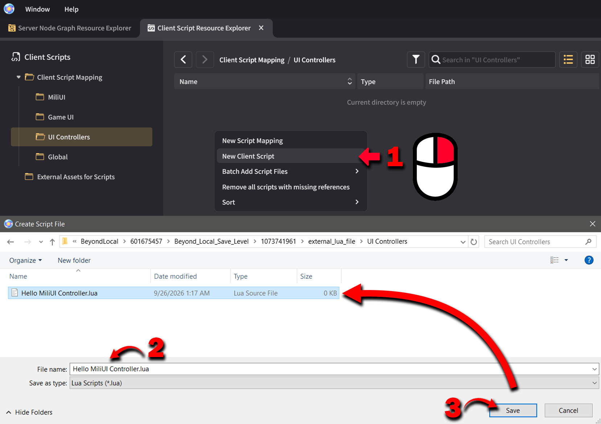
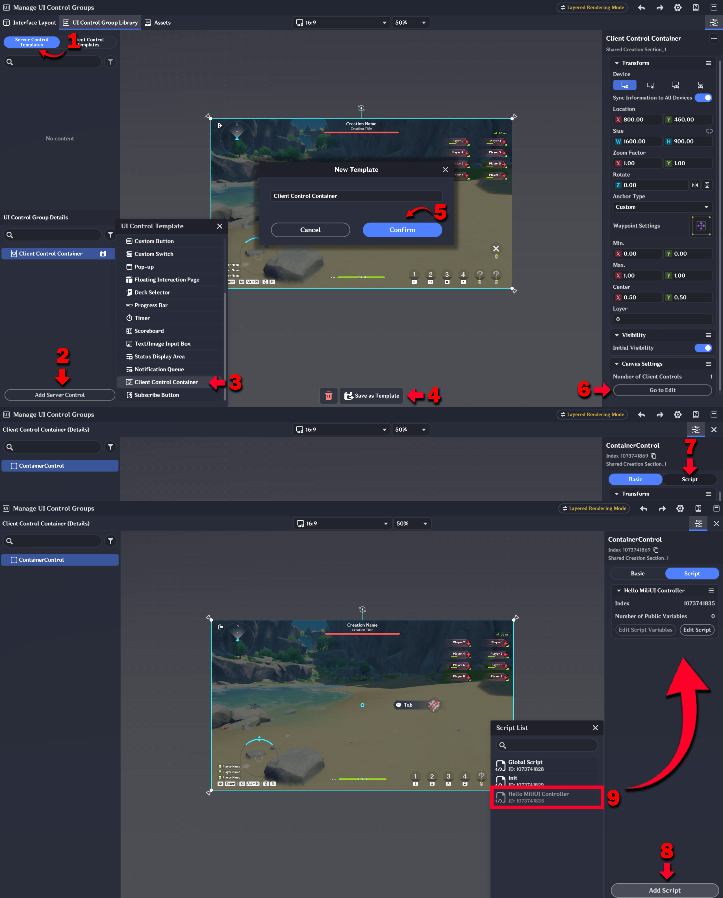
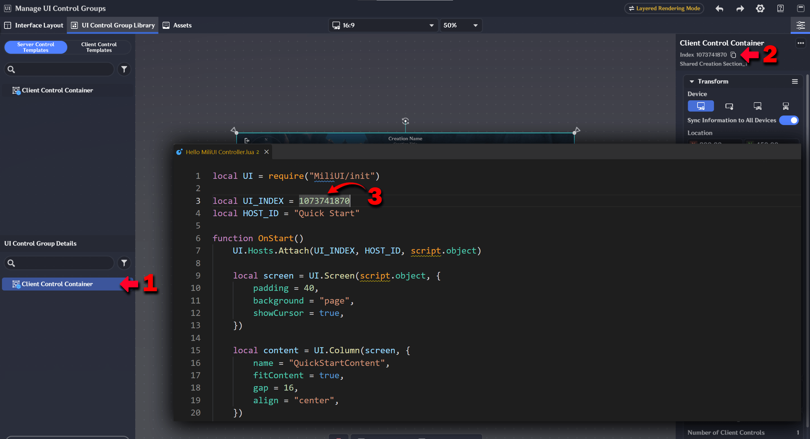
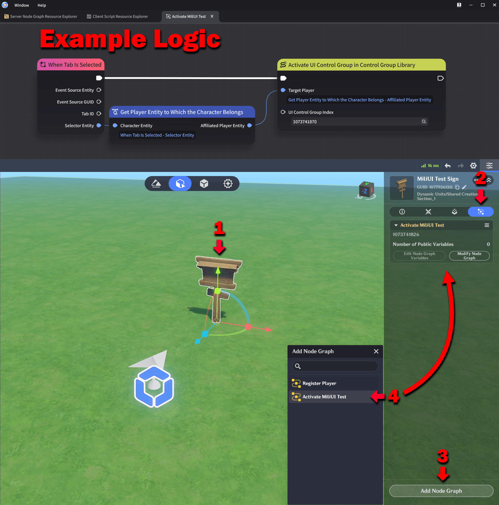
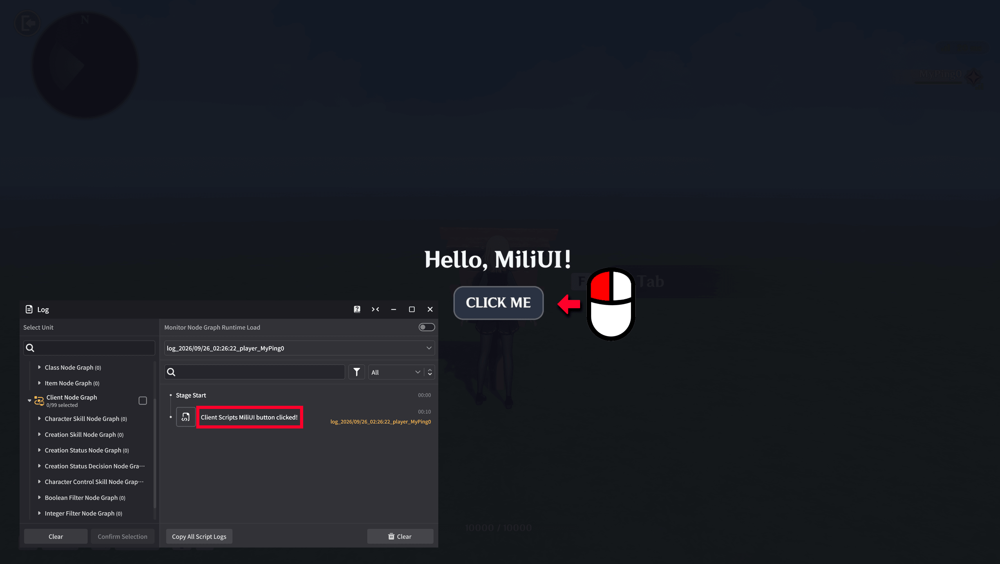

# MiliUI Quick Start

This guide builds one small MiliUI interface from scratch and explains the important code as you go.

You do **not** need previous Lua experience to follow the code below. This guide does assume that the one-time MiliUI project setup is already complete.

## Before you start

Before continuing, complete [Installation + Setup](docs/Installation.md). It installs MiliUI, maps `MiliUI/init` in the Sandbox, creates the Global Script, creates the Client Control Templates, and initializes them.

The [Recommended Game Project Structure](docs/ProjectStructure.md) is optional background if you want to see how larger MiliUI projects are usually organized.

By the end of this Quick Start, you will have:

- one Client Control Container Server Template;
- one UI controller Client Script;
- a MiliUI Screen with a Heading and Button;
- a Button click that prints to the Client Script Log.

## 1. Create the UI controller Client Script

Open:

```text
Window
→ Client Script Resource Explorer
→ Client Script Mapping
→ UI Controllers
```

Create a **New Client Script** and save it as:

```text
Hello MiliUI Controller.lua
```

[](docs/images/getting-started/create-test-controller-script.png)

The `UI Controllers` folder name is only a recommendation. What matters is that the script is available in the Client Script Resource Explorer so it can be attached to the root `ContainerControl` inside a Client Control Container.

## 2. Create a Client Control Container Server Template

Open the **UI Control Group Library** and switch to **Server Control Templates**.

Create a **Client Control Container** Server Template, give it a clear name such as `Hello MiliUI`, then open it for editing.

Open the Client Control Container for editing. Select the top-level `ContainerControl` in the hierarchy, open that control's **Script** tab, and add:

```text
Hello MiliUI Controller
```

[](docs/images/getting-started/attach-ui-controller-script.png)

The **Client Control Container Server Template** is what the server activates. Inside it, each Client Control can have its own attached Client Scripts.

For this controller, we attach the script to the top-level `ContainerControl`. When the Server Template is created for a player, that control is instantiated and the controller script starts.

Inside the script, `script.object` refers to the live `ContainerControl` that this script is attached to. MiliUI uses that object as this controller's native Host root.

## 3. Open the controller script

Open `Hello MiliUI Controller.lua`.

We will add the code in small pieces and explain each one immediately.

## 4. Build the interface

### 4.1 Load MiliUI and set the UI Index

Select the Server Control Template you created earlier and find its **Index** in the details panel.

[](docs/images/getting-started/ui-control-group-index.png)

The UI Index is Miliastra's numeric identity for this UI entry. MiliUI stores that same Index with the Host so your game can refer back to the native UI entry when needed.

For example, if the editor shows:

```text
Index: 1073741870
```

start with:

```lua
local UI = require("MiliUI/init")

local UI_INDEX = 1073741870
local HOST_ID = "Hello MiliUI"
```

Use the 10-digit Index shown for your own Server Control Template.

`require("MiliUI/init")` loads the MiliUI runtime that was mapped during [Installation + Setup](docs/Installation.md).

`HOST_ID` is a readable name that **you choose** for this interface inside MiliUI.

For now, think of the two values as:

```text
UI_INDEX -> how Miliastra identifies this UI entry
HOST_ID  -> how MiliUI identifies this interface
```

### 4.2 Attach this interface as a Host

Add:

```lua
function OnStart()
    UI.Hosts.Attach(UI_INDEX, HOST_ID, script.object)
end
```

A **Host** is MiliUI's name for one active UI root.

This line registers `script.object` as the live native root for the `"Hello MiliUI"` Host.

It does **not** decide where every control is physically placed. The parent you pass to `UI.Screen`, `UI.Button`, and other MiliUI controls does that.

The Host tells MiliUI which interface owns the controls and related runtime work created under this root, such as listeners, tweens, layout state, and Pages. That lets MiliUI manage or clean up one interface without affecting another Host such as a HUD or overlay.

Here, `script.object` comes from Miliastra and refers to the top-level `ContainerControl` where you attached this controller script in Step 2.

### 4.3 Create the Screen

Inside `OnStart()`, after `Attach`, add:

```lua
local screen = UI.Screen(script.object, {
    padding = 40,
    background = "page",
    showCursor = true,
})
```

Most MiliUI controls follow this pattern:

```lua
UI.SomeControl(parent, {
    -- settings
})
```

The **first argument** is the parent: where the new control should be placed.

Here the parent is `script.object`, so the Screen is created inside the native Client Control that owns this controller.

The settings mean:

- `padding = 40` leaves space between normal content and the Screen edges;
- `background = "page"` uses the MiliUI theme color named `page`;
- `showCursor = true` asks Miliastra to show the cursor while this Screen is active.

`"page"` is one of MiliUI's built-in theme color names. The default theme stores colors under names such as `page`, `surface`, `text`, and `accent`. So `background = "page"` means "use the current theme's page background color." If you later change the theme, controls using `"page"` automatically follow the new value.

### 4.4 Add a Column

Add:

```lua
local content = UI.Column(screen, {
    name = "HelloContent",
    fitContent = true,
    gap = 16,
    align = "center",
})

UI.Center(content)
```

The first argument is now `screen`, so the Column is created inside the Screen.

A Column lays out its children from top to bottom.

The settings mean:

- `name` gives the control a useful debugging name;
- `fitContent = true` lets the Column size itself around its children;
- `gap = 16` leaves 16 UI units between children;
- `align = "center"` centers children across the Column.

`UI.Center(content)` places the finished Column in the center of its parent area.

### 4.5 Add a Heading

Create a Heading inside the Column:

```lua
UI.Heading(content, {
    text = "Hello, MiliUI!",
    needsTranslation = false,
    fitWidth = true,
    fitWidthPadding = 16,
})
```

Because the parent is `content`, the Heading becomes one of the Column's children.

The settings mean:

- `text` is the text to display;
- `needsTranslation = false` uses the text exactly as written;
- `fitWidth = true` lets MiliUI size the text box from the text;
- `fitWidthPadding = 16` gives the width estimate a little extra room.

Miliastra does not currently expose the exact final rendered text width to Lua, so MiliUI estimates it. A small `fitWidthPadding` is useful for short text that should size itself.

### 4.6 Add a Button

Add a Button to the same Column:

```lua
local button = UI.Button(content, {
    label = {
        text = "CLICK ME",
        needsTranslation = false,
    },
    fitContent = true,
})

button:OnClick(function()
    print("MiliUI button clicked!")
end)
```

Because the parent is also `content`, the Button appears below the Heading in the same Column.

`fitContent = true` lets the Button size itself from its label and normal Button padding.

`button:OnClick(...)` registers the function that runs when the Button is activated.

The `print(...)` message appears in the Miliastra Sandbox **Log**, not on the game screen.

### 4.7 Detach the Host when the Client Control Container disappears

Outside `OnStart()`, add:

```lua
function OnDestroy()
    if UI.Hosts.IsAttached(HOST_ID) then
        UI.Hosts.Detach(HOST_ID)
    end
end
```

Miliastra calls `OnDestroy()` when the Client Control this script is mounted on is being removed.

`UI.Hosts.Detach(HOST_ID)` tells MiliUI that this Host's native root is gone, so MiliUI can release the live controls, listeners, tweens, and other runtime work associated with that Host.

`Detach` is different from `UI.Pages.Close(...)`. Detaching means the native Host root disappeared, while remembered Page state and the Host's UI Index can be kept for later restoration. Closing a Page means the user or game is logically done with that Page and removes it from the open-page state.

This first example does not use Pages yet, but the distinction becomes important in larger interfaces. Use `Detach` for normal cleanup of one Host. `UI.DestroyAll()` is broader and affects every currently attached Host.

## 5. Complete controller script

Your full `Hello MiliUI Controller.lua` should now look like this:

```lua
local UI = require("MiliUI/init")

local UI_INDEX = 1073741870
local HOST_ID = "Hello MiliUI"

function OnStart()
    UI.Hosts.Attach(UI_INDEX, HOST_ID, script.object)

    local screen = UI.Screen(script.object, {
        padding = 40,
        background = "page",
        showCursor = true,
    })

    local content = UI.Column(screen, {
        name = "HelloContent",
        fitContent = true,
        gap = 16,
        align = "center",
    })

    UI.Center(content)

    UI.Heading(content, {
        text = "Hello, MiliUI!",
        needsTranslation = false,
        fitWidth = true,
        fitWidthPadding = 16,
    })

    local button = UI.Button(content, {
        label = {
            text = "CLICK ME",
            needsTranslation = false,
        },
        fitContent = true,
    })

    button:OnClick(function()
        print("MiliUI button clicked!")
    end)
end

function OnDestroy()
    if UI.Hosts.IsAttached(HOST_ID) then
        UI.Hosts.Detach(HOST_ID)
    end
end
```

Remember to replace `1073741870` with your actual UI Index.

## 6. Activate the UI from server logic

Creating a Server Control Template does not by itself decide **when** your game should show it.

Your server Node Graph should activate the UI for the appropriate player when your game wants this interface to appear.

The image below shows one example that activates the UI from an interaction:

[](docs/images/getting-started/activate-server-control-template-logic.png)

You do **not** need to copy that exact trigger. Your game might activate the UI when:

- the stage starts;
- a player interacts with something;
- a menu button is selected;
- a server-side game event occurs.

The important part is that the server activates the Server Control Template that contains your Client Control Container.

## 7. Test it

Before starting Test Play, open the Miliastra Sandbox **Log** and start monitoring **Client Scripts**.

Then enter Test Play and activate the UI using the server logic from the previous step.

You should see:

- a dark MiliUI Screen;
- **Hello, MiliUI!** in the center;
- a **CLICK ME** Button underneath it.

Click the Button. In the Client Script Log, you should see:

```text
MiliUI button clicked!
```

[](docs/images/getting-started/quick-start-result.png)

If both the interface and Log message appear, the main path is working:

```text
MiliUI runtime loaded
→ shared templates were initialized
→ server activated the UI
→ Client UI hierarchy created
→ controller script started
→ Host attached
→ MiliUI created the controls
→ Button received input
```

## Troubleshooting

### `MiliUI.InitTemplates(...) must be called before creating controls`

The shared template setup did not finish before this controller tried to create a MiliUI control.

Check [Installation + Setup](docs/Installation.md) and make sure:

- the correct Global Script is assigned in Stage Settings;
- its template Script Variables are filled in;
- `UI.InitTemplates(...)` is called from the Global Script's `OnInit()`.

### `require("MiliUI/init")` cannot be resolved

Make sure the installed `external_lua_file/MiliUI` folder is mapped under **Client Script Resource Explorer → Client Script Mapping → MiliUI**.

### Nothing appears on screen

Check that:

- the Server Control Template is actually being activated for the player;
- the attached controller script is `Hello MiliUI Controller`;
- `UI_INDEX` matches the Index shown for that UI entry.

### The Button works but I do not see the printed message

`print(...)` goes to the Sandbox **Log → Client Scripts**, not onto the game screen.

## What to learn next

- [Installation + Setup](docs/Installation.md)
- [Recommended Game Project Structure](docs/ProjectStructure.md)
- [Control Groups and MiliUI Hosts](docs/ControlGroups.md)
- [Components](docs/Components.md)
- [Responsive Layout](docs/ResponsiveLayout.md)
- [Pages](docs/Pages.md)
- [Controller Support](docs/ControllerSupport.md)
- [Localization](docs/Localization.md)
- [Theming](docs/Theming.md)

For additional copyable examples, see [examples/getting-started](examples/getting-started/README.md).
