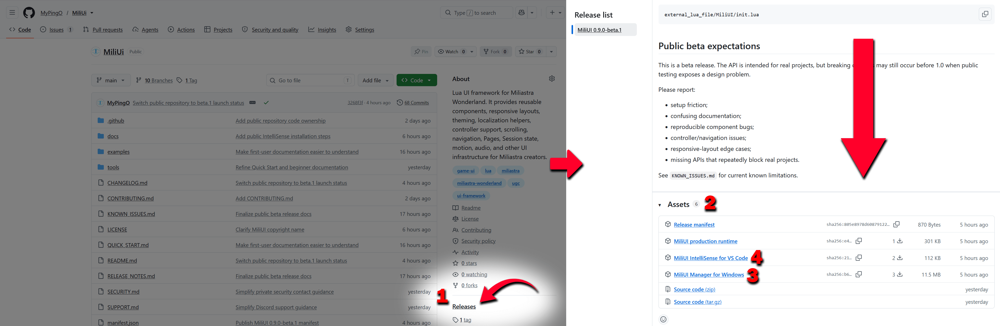
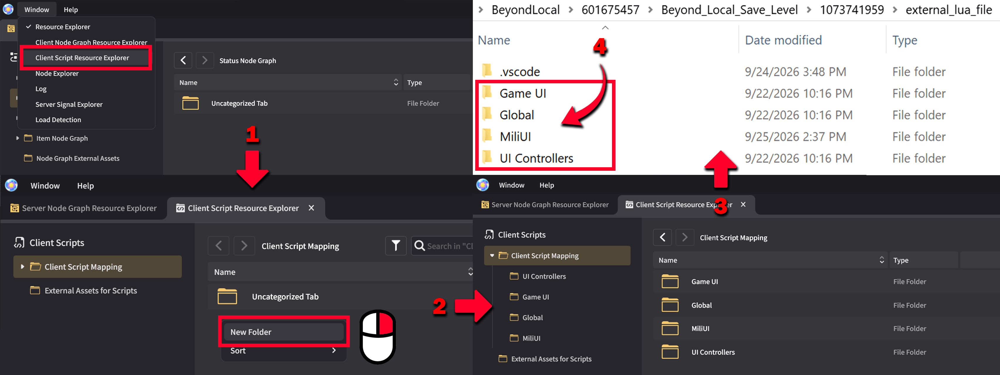
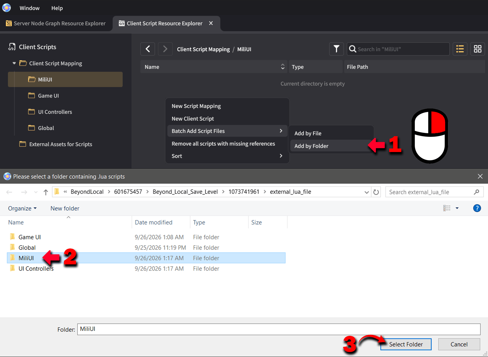
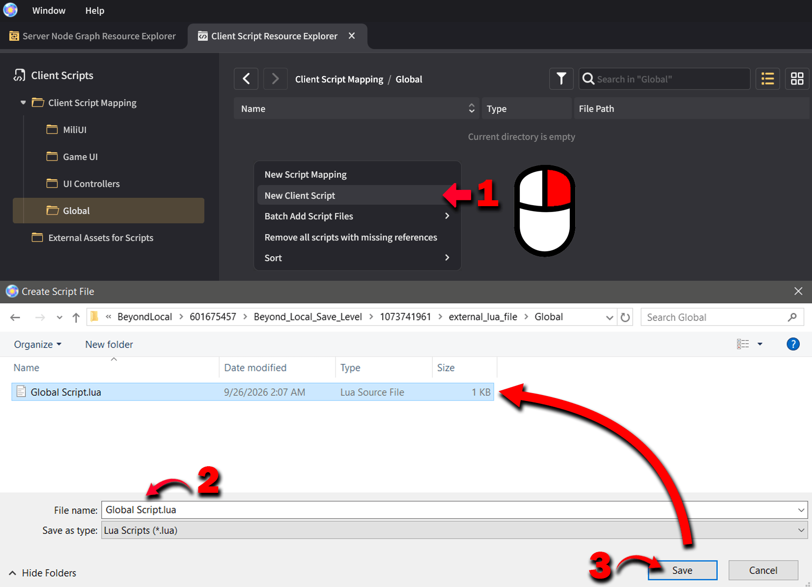
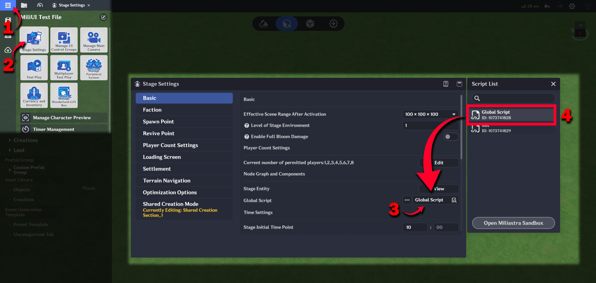
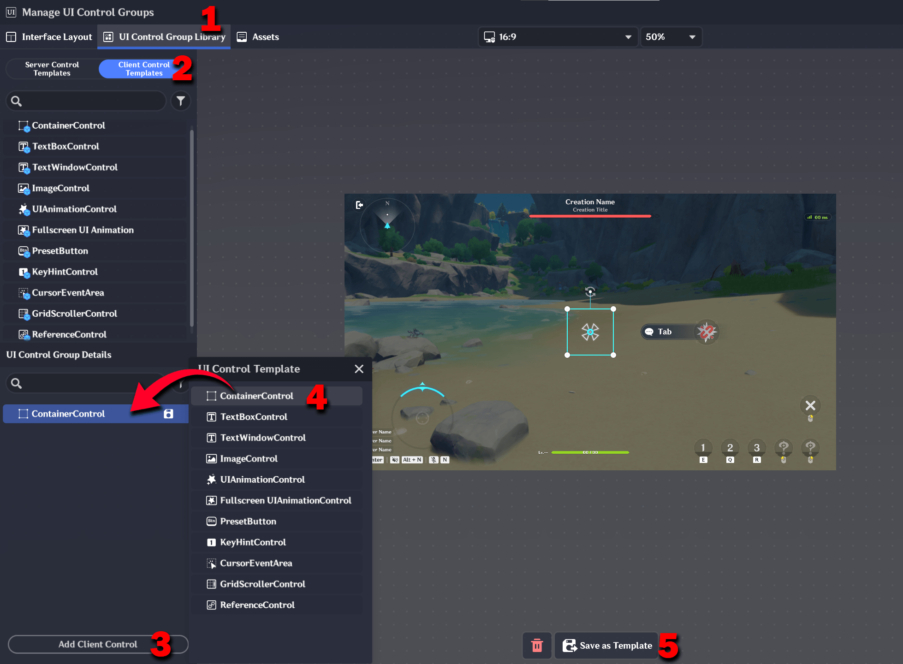
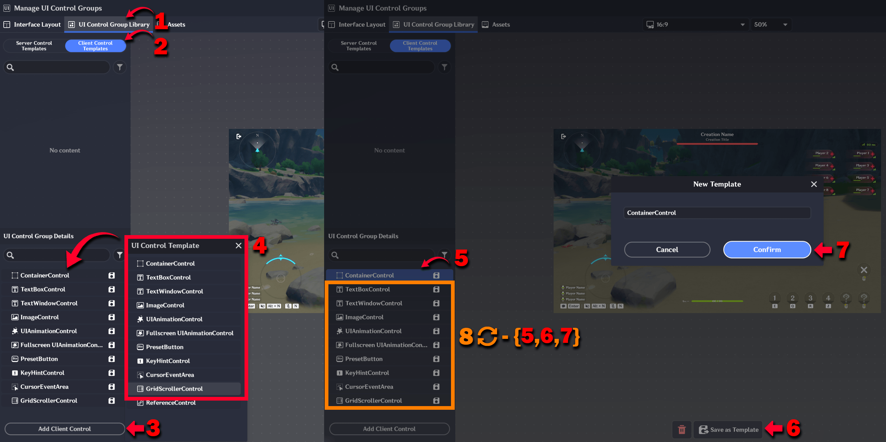
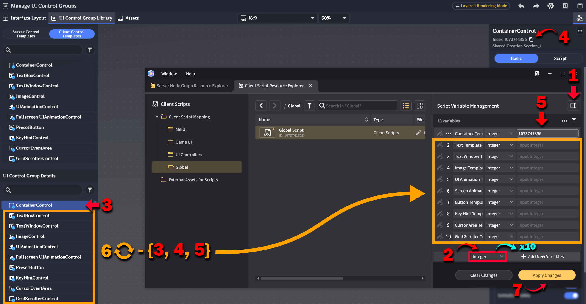
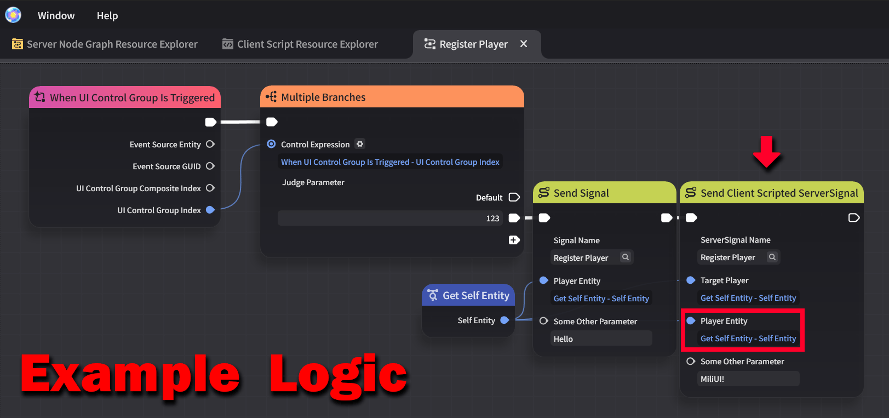

# Installation + Setup

This guide takes a new Miliastra project from **no MiliUI setup** to a project that is ready to follow the [Quick Start](../QUICK_START.md).

You do not need previous Lua experience. The steps below explain the Miliastra-specific setup that MiliUI needs before an interface can be created.

> **Starting a new project?** You can skip most of this one-time boilerplate by importing the ready-to-use MiliUI starter save. It already includes the Global Script, required Client Control Templates, template variables, example controller, and Quick Start interface. See [Starter Template](#starter-template) at the end of this guide.

> If MiliUI is already installed, mapped in the Client Script Resource Explorer, and your Global Script already initializes the MiliUI templates in `OnInit()`, you can skip to the [Quick Start](../QUICK_START.md).

## 1. Download MiliUI

Open the [MiliUI GitHub Releases](https://github.com/MyPingO/MiliUI/releases).

For a normal Windows setup, download **MiliUI Manager for Windows**, the recommended way to install or update the runtime.

MiliUI IntelliSense is installed separately from the **Visual Studio Marketplace**. See [Optional: install MiliUI IntelliSense](#10-optional-install-miliui-intellisense) below.

The GitHub Release also contains the production runtime for manual installation and a VSIX fallback for IntelliSense.

[](images/getting-started/github-release-downloads.png)

### Install with MiliUI Manager

1. Open `MiliUI-Manager.exe`.
2. Select the Miliastra project you want to use.
3. Click **Install MiliUI**.

The Manager installs:

```text
external_lua_file/
└─ MiliUI/
   └─ init.lua
```

If MiliUI is already installed, the Manager creates a backup before replacing it.

The Manager also checks the downloaded runtime against its published SHA-256 file hash before installing it.

> **Windows SmartScreen:** the current beta Manager is not code-signed, so Windows may show an **Unknown publisher** SmartScreen warning. Only continue when the Manager was downloaded from the official MiliUI GitHub Release linked above.

### Manual installation

If you prefer not to use the Manager, download the production `MiliUI-init.lua` release asset and place it at:

```text
external_lua_file/MiliUI/init.lua
```

If replacing an existing install manually, make your own backup first.

## 2. Use a clear project folder structure

MiliUI does not require a particular folder layout, but keeping the Windows files and the Miliastra **Client Script Resource Explorer** organized the same way makes a project much easier to understand.

A useful starting layout is:

```text
external_lua_file/
├─ MiliUI/
│  └─ init.lua
├─ Global/
│  └─ Global Script.lua
├─ UI Controllers/
│  └─ Hello MiliUI Controller.lua
└─ Game UI/
   └─ ...
```

The folders have different jobs:

- `MiliUI/` contains the installed framework runtime;
- `Global/` contains project-wide client setup such as template initialization;
- `UI Controllers/` contains scripts attached to Client Control Containers;
- `Game UI/` is a useful place for larger Page/data modules once your UI grows.

These names are recommendations, not MiliUI requirements.

In the Sandbox, open **Window → Client Script Resource Explorer** and create matching folders under **Client Script Mapping**.

[](images/getting-started/sandbox-windows-folder-structure.png)

For a larger project, see [Recommended Game Project Structure](ProjectStructure.md).

## 3. Map the installed MiliUI runtime in the Sandbox

Having `external_lua_file/MiliUI/init.lua` on disk is not enough by itself. Miliastra also needs that file available through the **Client Script Resource Explorer** so your scripts can load it with:

```lua
local UI = require("MiliUI/init")
```

In **Client Script Resource Explorer**:

1. open the `MiliUI` folder under **Client Script Mapping**;
2. use **Add by Folder**;
3. select the installed `external_lua_file/MiliUI` folder;
4. confirm that `init` appears inside the Sandbox `MiliUI` mapping.

[](images/getting-started/create-miliui-init-mapping.png)

This mapping is what makes `require("MiliUI/init")` resolve to the installed MiliUI runtime.

## 4. Create the project Global Script

MiliUI's shared template setup should live in a persistent **Global Script** so every interface can use the same configuration.

Open the `Global` folder in **Client Script Resource Explorer**, create a **New Client Script**, and save it as:

```text
Global Script.lua
```

[](images/getting-started/create-global-script.png)

## 5. Assign the Global Script in Stage Settings

Creating the file does not automatically make it the stage's Global Script.

Open **Stage Settings** and assign the `Global Script` you just created to the stage's **Global Script** setting.

[](images/getting-started/stage-settings-global-script.png)

This script will now run as the persistent client Global Script for the stage.

## 6. Create the Client Control Templates MiliUI uses

Miliastra creates Client UI controls from templates made in the UI editor. MiliUI uses those same native templates when it creates controls from Lua.

Open:

```text
UI Control Group Library
→ Client Control Templates
```

Create a template by adding the Client Control, saving it as a template, and giving it a clear name.

[](images/getting-started/create-client-control-template.png)

For a new MiliUI project, create one template for every currently-supported native control type. The list below follows the same order as the Miliastra editor:

1. `ContainerControl`
2. `TextBoxControl`
3. `TextWindowControl`
4. `ImageControl`
5. `UIAnimationControl`
6. `Fullscreen UI Animation`
7. `PresetButton`
8. `KeyHintControl`
9. `CursorEventArea`
10. `GridScrollerControl`

You do **not** need a `ReferenceControl` template for normal MiliUI setup.

[](images/getting-started/client-control-templates.png)

Creating the full set once means later MiliUI components can use these native control types without requiring more setup.

## 7. Add the template IDs as Global Script Variables

Each Client Control Template has an integer **Index**. The Global Script needs those indexes so MiliUI knows which native template to instantiate for each control type.

Add these **Integer** Script Variables to `Global Script.lua` and set each one to the Index of the matching Client Control Template:

| Editor template | Global Script variable name |
| --- | --- |
| `ContainerControl` | `Container Template ID` |
| `TextBoxControl` | `Text Template ID` |
| `TextWindowControl` | `Text Window Template ID` |
| `ImageControl` | `Image Template ID` |
| `UIAnimationControl` | `UI Animation Template ID` |
| `Fullscreen UI Animation` | `Screen Animation Template ID` |
| `PresetButton` | `Button Template ID` |
| `KeyHintControl` | `Key Hint Template ID` |
| `CursorEventArea` | `Cursor Area Template ID` |
| `GridScrollerControl` | `Grid Scroller Template ID` |

[](images/getting-started/global-script-variables.png)

The Script Variable names above are the names used throughout the MiliUI examples. MiliUI itself only receives the resulting integer values.

## 8. Initialize MiliUI templates in `OnInit()`

Open `Global Script.lua` and add:

```lua
local UI = require("MiliUI/init")

local function InitTemplates()
    UI.InitTemplates({
        container = script:GetParam("Container Template ID"),
        text = script:GetParam("Text Template ID"),
        textWindow = script:GetParam("Text Window Template ID"),
        image = script:GetParam("Image Template ID"),
        animation = script:GetParam("UI Animation Template ID"),
        fullscreenAnimation = script:GetParam("Screen Animation Template ID"),
        button = script:GetParam("Button Template ID"),
        keyHint = script:GetParam("Key Hint Template ID"),
        cursorArea = script:GetParam("Cursor Area Template ID"),
        gridScroller = script:GetParam("Grid Scroller Template ID"),
    })
end

function OnInit()
    InitTemplates()
end
```

`UI.InitTemplates({...})` tells MiliUI which editor template belongs to each native control type.

The names on the left side of each `=` — such as `container`, `text`, `button`, and `cursorArea` — are MiliUI's template names. The value on the right reads the matching Script Variable you created in Step 7.

We use **`OnInit()`** here because it runs earlier than the more commonly used `OnStart()`. At stage startup, the Global Script's `OnInit()` runs before Client Control scripts reach their `OnStart()` functions, so the template mapping is ready before any already-active UI tries to create MiliUI controls.

This matters when a Client Control Container is already active when the stage starts. Initializing the templates later can produce:

```text
MiliUI.InitTemplates(...) must be called before creating controls
```

## 9. Optional: register the local Player Entity

You only need this section if your UI uses `UI.Player`.

MiliUI can store the local Player Entity after your game sends it from the server. The Global Script is a good place to install that listener once.

For example:

```lua
function OnInit()
    InitTemplates()

    UI.Player.RegisterFromSignal(
        script,
        "Register Player"
    )
end
```

The server-side signal named `"Register Player"` should send the local Player Entity as its first parameter.

The image below shows one example of server Node Graph logic. Your own server initialization can be structured differently; the important part is that the signal is sent to the client after the listener is available.

[](images/getting-started/register-player-signal.png)

If your project never uses `UI.Player`, skip this section.

See [Player Context](Player.md) for the full API and reconnect behavior.

## 10. Optional: install MiliUI IntelliSense

MiliUI IntelliSense is separate from the runtime.

It adds MiliUI autocomplete, hover information, and type information to VS Code through Lua Language Server (LuaLS). It does **not** install or change the runtime used by Miliastra.

The recommended installation is:

1. open the VS Code **Extensions** view;
2. search for **MiliUI IntelliSense**;
3. confirm it is published by **MyPing0**;
4. click **Install**.

You can also open [MiliUI IntelliSense on the Visual Studio Marketplace](https://marketplace.visualstudio.com/items?itemName=MyPing0.miliui-intellisense).

See [MiliUI IntelliSense](IntelliSense.md) for the VSIX fallback, expected editor behavior, and troubleshooting.

## Setup checklist

Before continuing to the Quick Start, make sure:

- `external_lua_file/MiliUI/init.lua` exists;
- `MiliUI/init` is mapped in the Client Script Resource Explorer;
- the project's Global Script is assigned in Stage Settings;
- all ten MiliUI Client Control Templates exist;
- the Global Script has the ten template-ID Script Variables;
- the Global Script calls `UI.InitTemplates(...)` from `OnInit()`.

Once those are complete, continue to the [MiliUI Quick Start](../QUICK_START.md).

## Starter Template

For a new project, or as a working reference if manual setup is giving you trouble, you can use the ready-to-use **MiliUI Template Save File** instead of rebuilding the one-time setup from scratch.

The starter is distributed as:

```text
MiliUI-Template-Save-File.gil
```

Download it from the [MiliUI v0.9.0-beta.1 GitHub Release](https://github.com/MyPingO/MiliUI/releases/tag/v0.9.0-beta.1), then import/open it as a new Miliastra save.

The starter save already includes:

- the project Global Script;
- the required MiliUI Client Control Templates;
- the ten Global Script template-ID variables;
- the `MiliUI/init` mapping;
- `Hello MiliUI Controller.lua`;
- the Client Control Container used by the Quick Start;
- the Quick Start example interface;
- example server logic for Player registration and UI activation.

The published starter save was tested by importing it as a fresh save and entering Test Play successfully. The template references and UI Index survived that import correctly.

### Before Test Play

Even though the included references should already be correct, confirm these two things after importing:

1. **Confirm the Client Control Container UI Index.** The included `Hello MiliUI Controller.lua` currently uses:

   ```lua
   local UI_INDEX = 1073741870
   ```

   Select the included Client Control Container Server Template and confirm that its **Index** is also `1073741870`. If Miliastra shows a different Index, update `UI_INDEX` in the controller script to match it.

2. **Confirm the Client Control Template indexes.** Open the Global Script variables and verify that all ten template-ID variables still contain the Index of the matching Client Control Template. Use the mapping table in [Step 7](#7-add-the-template-ids-as-global-script-variables) to compare them.

After those checks, enter Test Play. The included **Hello, MiliUI!** interface should appear immediately. If Client Script Log monitoring is enabled, clicking **CLICK ME** should print:

```text
MiliUI button clicked!
```

The manual setup above remains useful for adding MiliUI to an existing project and for understanding how the native Miliastra setup works.
